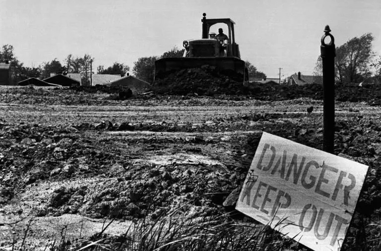
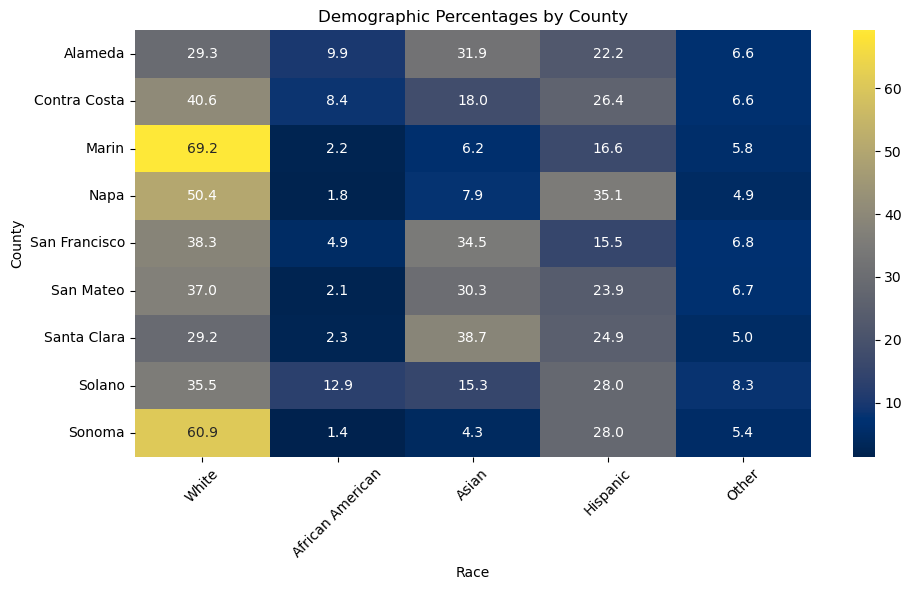
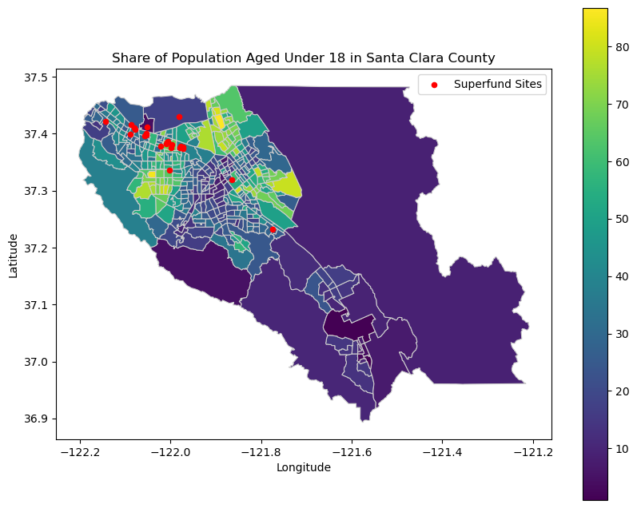

# Superfund Sites in Santa Clara County

### Hillary Nguyen Pham & Sanjana Appachu

## Introduction
Our project explores superfund sites in the San Francisco Bay Area and specifically those situated in Santa Clara County. Our objective was to explore the correlation between superfund sites and toxic release sites in Santa Clara County, examining their impact on property values and any demographic associations with these sites. We are curious to see if there is any correlation between superfund sites and property values that sheds light on the economic and public health implications of environmental contamination. Additionally, to see if we can delve into potential disparities in property value that contribute to discussions on social equity and environmental justice. 

### Research Question 
What is the relationship between Superfund Sites and property values in Santa Clara County? 

## Background
### What is a Superfund Site?

Superfund sites are locations across the United States where uncontrolled releases of hazardous substances into the air, water, and soil have occurred, posing risks to human health and the environment. These sites can result from industrial accidents, improper waste disposal practices, or other activities that have led to contamination.

When sites pose significant risks and require long-term cleanup efforts, they may be added to the National Priorities List (NPL) by the Environmental Protection Agency (EPA). The NPL identifies the most serious hazardous waste sites in the country and prioritizes them for remediation under the Superfund program.

The Superfund program was established by the Comprehensive Environmental Response, Compensation, and Liability Act (CERCLA) of 1980, commonly known as the Superfund Act. This legislation provided the legal framework and funding for the cleanup and remediation of polluted and contaminated lands. The primary goal of the Superfund program is to protect human health and the environment by addressing the risks posed by hazardous waste sites.

Superfund sites undergo a comprehensive process of investigation, evaluation, and cleanup, which may involve containment, removal, or treatment of hazardous substances to prevent further environmental degradation and mitigate risks to public health. The cleanup process can be complex and may require the coordination of multiple stakeholders, including federal, state, and local agencies, as well as private entities responsible for the contamination. In addition to cleanup efforts, the Superfund program also focuses on holding responsible parties accountable for the costs of remediation through a process known as "polluter pays." This involves identifying parties responsible for the contamination and requiring them to either clean up the site themselves or contribute financially to the cleanup efforts.

Overall, Superfund sites represent a commitment to addressing environmental pollution and protecting communities from the adverse effects of hazardous substances. Through the Superfund program, efforts are made to remediate contaminated sites, restore ecosystems, and safeguard public health for present and future generations.

### Superfund Sites in the Bay Area

***insert map of superfund sites in the bayarea

## Data Sources 
1. American Community Survey (ACS) 2012 and 2022 Census 5-Year Estimates
2. EPA Superfund’s National Priorities List (NPL)
3. CalEnviroScreen 4.0

## Methdology

American Community Survey 2022 5-Year Estimates
We began our study by first utilizing the ACS demographic data to visualize the racial distribution across the nine Bay Area Counties. For the purpose of this study, we considered “Native Hawaiian and Other Pacific Islander”, “American Indian and Alaska Native” and “Two or More Races” as a part of the “Other” race category. ACS Table: B02001

Taking a closer look at Santa Clara County, we further used data from Table: B19013 to analyze Median Household Incomes Adjusted for inflation. We also used data to compare 2012 and 2022 Median Property Values from Table: B25077. 

EPA Superfund’s National Priorities List (NPL)
We used the data from the NPL to project

## Analysis
We focused our exploration on Santa Clara County rather than the entire nine-county Bay Area. The decision to do this came after an initial analysis of conducting a count of how many Superfund sites were in each county. 

### Santa Clara County 

## Key Findings

#### Geographical Distribution of Superfund Sites: 
The majority of Superfund sites within Santa Clara County are strategically situated in close proximity to significant landmarks such as the San Jose Airport and along the bay edge. This spatial concentration suggests a potential correlation between industrial activity or historical land use and the presence of hazardous waste sites.

#### Stability in Property Values: 
Over the period from 2012 to 2022, the median property values across Santa Clara County have exhibited a consistent trend, showing no significant deviation. This stability suggests that despite the presence of Superfund sites, broader economic factors and other local dynamics might have a more dominant influence on property values in the region.

#### Resilience of Local Economy: 
Despite the existence of five Superfund sites within a specific census tract, the median household income in 2022 surpassed $250,000. This observation indicates a remarkable economic resilience within the community, where despite potential environmental concerns, residents have managed to maintain high levels of income, possibly due to diverse economic opportunities or other mitigating factors.

These findings collectively shed light on the intricate relationship between environmental risk, economic dynamics, and community resilience within Santa Clara County. While the presence of Superfund sites may raise environmental and health concerns, the stability of property values and the robustness of the local economy underscore the complexity of factors influencing the lived experiences of residents in proximity to hazardous waste sites.

## Conclusions and Next Steps

As a next step, we would be accessing the timeline for past Superfund Sites that were cleaned up in Santa Clara County and compare property values of before/after it became a reuse site. 
We are also interested to take a closer look and analyse the other eight Bay Area Counties which include Contra Costa, Alameda, Solano, Sonoma, Napa, Marin, San Francisco and San Mateo. We believe insights gleaned from this study offer valuable guidance for various stakeholders, including policy makers, planners, designers, researchers, and city governments, particularly in the realms of health equity.

## References

[Pollution, Poverty and People of Color: Living with Industry](https://www.scientificamerican.com/article/pollution-poverty-people-color-living-industry/)

[Toxic waste sites and environmental justice: Research roundup](  https://journalistsresource.org/environment/superfund-toxic-waste-race-research/)
  
[Superfunds and Inequality](https://jeremybney.medium.com/superfunds-and-inequality-a45d9598cc49)

[The Superfund Sites of Silicon Valley](https://www.nytimes.com/2018/03/26/lens/the-superfund-sites-of-silicon-valley.html#:~:text=From%20its%20origins%20as%20a,any%20county%20in%20the%20country)

[Silicon Valley is home to more toxic Superfund sites than anywhere else in the country](https://qz.com/1017181/silicon-valley-pollution-there-are-more-superfund-sites-in-santa-clara-than-any-other-us-county)

[Toxicology and Societies: The Impacts of Chemicals in our Lives](https://foundation.wwu.edu/event/environmental-injustice-toxic-waste-sites)

[Targeting minority, low-income neighborhoods for hazardous waste sites](https://news.umich.edu/targeting-minority-low-income-neighborhoods-for-hazardous-waste-sites/)

